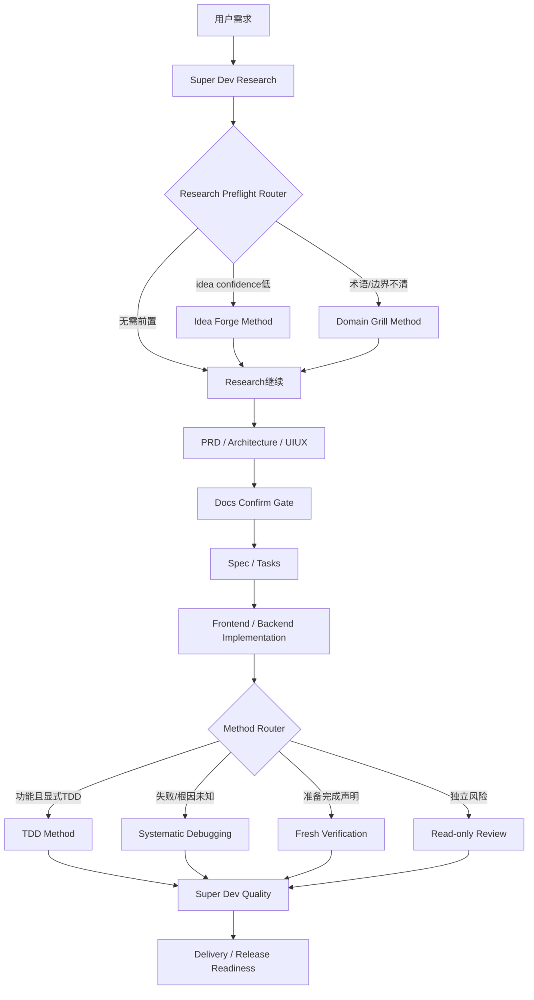

# Super Dev 可升级扩展平台：审计结论与实施计划

> 状态：Revised after independent Claude Code four-dimension review
> 计划日期：2026-08-19
> 研究基线：`d06e640153bd83fc63ef716e1149cf2b2bbf02ed`（Super Dev v2.4.0）
> 目标仓库：`mixyoung/super-dev`
> 上游仓库：`shangyankeji/super-dev`
> 本轮评审范围：合理性、工程化、教练性、商业交付
> 明确排除：版权、许可证与商标判断

## 1. 执行摘要

本计划不把 BMAD、Matt Pocock Skills、Superpowers 和 UmaDev 拼成一套新的巨型生命周期。目标是把 Super Dev 保持为唯一生命周期所有者，并将外部能力接成可选择、可追踪、可测试、可禁用、可升级的扩展方法和知识覆盖包。

目标结构分为可证明价值的最小内核与后续扩展层：

```text
Super Dev Core
  ├─ 唯一 workflow state
  ├─ Canonical stages / gates
  ├─ Coach cards
  ├─ Quality / delivery evidence
  └─ Minimum Extension Kernel (V1)
       ├─ manifest
       ├─ executor
       ├─ evidence
       └─ verification-before-completion (single call site)

Deferred until measured need
  ├─ registry / resolver / capability probe
  ├─ systematic-debugging / independent-review / tdd
  ├─ idea-forge / domain-grill
  └─ knowledge overlays
```

核心决策：

1. 不修改 Super Dev 的标准九阶段主链，不新增另一个生命周期状态机。
2. Forge 和 Grill 作为 `research` 内的可选方法，而不是正式独立阶段。
3. 外部方法不得拥有项目阶段、不得推进 Super Dev gate、不得创建第二份 workflow state。
4. `verification-before-completion` 为首个候选方法；TDD 不做全局强制。
5. UmaDev 知识不整库同步，只把差异主题作为候选，回到一手来源验证后重建。
6. 先清零现有 Windows 扩展面失败测试，再接入任何外部能力。
7. 所有增强都必须通过行为基线、压力测试、黄金项目和商业交付验收。
8. 首版只证明一个方法在一个调用点产生净收益；第三个方法出现真实路由需求前，不建设通用注册和解析平台。

## 2. 用户问题与产品目标

目标用户是一人公司创始人，具备有限编程经验，但没有在成熟软件组织中形成完整的产品、架构、测试、发布和运营经验。

该用户需要的不是更多角色名称，而是一个能完成以下工作的教练系统：

- 说明当前为什么处于这个阶段；
- 指出当前必须做出的产品或风险决定；
- 给出推荐答案并解释代价；
- 识别用户不知道自己应该问的问题；
- 阻止缺少关键证据的阶段推进；
- 允许明确的暂停、放弃、返工和恢复；
- 将代码、测试、运行、部署和运营证据绑定到同一个候选；
- 保持一个生命周期所有者和一个生产写入者；
- 不要求用户记忆多套工具命令和状态文件。

### 2.1 成功定义

成功不是“安装了更多 Skill”，而是：

1. 用户从一个模糊想法开始，可以在系统教练下形成可执行且边界清晰的产品定义；
2. 系统始终能回答“当前在哪、为什么、缺什么、下一步是什么”；
3. 工程方法只在匹配的阶段和任务触发，不制造双流程；
4. 完成声明具备新鲜、可检查、绑定到当前候选的证据；
5. 一个小型商业形态产品能从想法走到可运行、可发布、可监控、可回滚；
6. 增强版在相同任务上的正确验收时间、返工率和人工认知负担优于原版。

### 2.2 非目标

- 不把所有 Superpowers Skills 默认启用；
- 不移植 UmaDev 的协调者、角色团队、DAG 或状态机；
- 不运行完整 BMAD 生命周期；
- 不让 Forge、Grill 或外部 Reviewer 直接推进 Super Dev 阶段；
- 不以知识文件数量、篇幅或形式评分作为事实正确性的证明；
- 不在第一阶段重写 Super Dev 核心编排器；
- 不自动修改用户全局 Skill、Hook、MCP、凭据或模型配置；
- 不在本计划评审中讨论版权与许可证。

## 3. 已验证审计基线

### 3.1 Git与仓库基线

```text
HEAD=d06e640153bd83fc63ef716e1149cf2b2bbf02ed
branch=main
origin=mixyoung/super-dev
upstream=shangyankeji/super-dev
origin/main...upstream/main=0/0
git_fsck=pass
worktree=clean
```

### 3.2 知识库基线

```text
knowledge_files=307
markdown_files=306
total_lines=119280
total_bytes=4397712
files_with_last_updated=64
files_with_version_metadata=20
files_with_reference_section=75
files_with_url=148
```

当前文件最后源码变更：

| 日期 | 文件数 |
| --- | ---: |
| 2026-03-07 | 51 |
| 2026-03-20 | 35 |
| 2026-03-29 | 220 |
| 2026-04-22 | 1 |

项目自带 `scripts/knowledge_scorer.py` 的运行结果：

| 结果 | 数量 | 占比 |
| --- | ---: | ---: |
| Keep | 92 | 30% |
| Improve | 122 | 40% |
| Discard | 92 | 30% |
| 平均分 | 64.7/100 | - |

评分器目前根据篇幅、代码块、标题、表格、清单、关键词等形式指标评分，不验证技术版本、事实正确性、来源有效性、实际可执行性或最后验证日期。因此 `quality_score` 不得再被描述为知识正确性证明。

已确认的知识问题样例：

- `knowledge/frontend/01-standards/nextjs-complete.md` 将 App Router 的引入描述为 Next.js 14+；官方历史显示 Next.js 13 引入、13.4 稳定。
- React 内容没有覆盖 React 19 的关键变化，而当前官方主版本为 React 19。
- OWASP Top 10 文档仍固定为 2021，未声明后续版本跟踪策略。

### 3.3 UmaDev知识差异基线

基于 Git Blob 的远程比较：

```text
super_dev_knowledge_blobs=307
umadev_knowledge_blobs=469
same_paths=307
identical_blobs=1
changed_shared_paths=306
umadev_new_paths=162
super_dev_only_paths=0
```

这证明 UmaDev 是 Super Dev 知识树的后继分支，但不能证明其内容全部正确。UmaDev 新增主题可作为 gap candidates，不作为可直接覆盖的权威源。

### 3.4 扩展面基线

已存在：

- `HookManager`：Pre/Post Phase、OnError、WorkflowEvent；
- `SkillManager`：从 Git 或本地目录复制外部 Skill；
- `workflow_stage_truth.py`：内部 engine phase 到 canonical stage 的映射；
- Hook历史、workflow event、release readiness审计面；
- 自定义Validation Checker注册能力。

已发现缺陷：

1. `HookType.PYTHON` 被模型声明，但配置执行器未实现；
2. Pre/Post Phase只直接覆盖内部 engine phases，未完整覆盖 `spec/frontend/preview_confirm/backend`；
3. WorkflowEvent只覆盖部分状态保存事件，不是完整阶段事件总线；
4. Command Hook使用 `shell=True` 字符串执行；
5. 外部Skill安装仅做浅克隆和复制，不记录commit、digest、来源、适用阶段、能力需求、冲突或写入权限；
6. Windows路径写入双引号YAML时会触发反斜杠转义问题；
7. 知识来源路径在Windows使用反斜杠，破坏跨平台身份比较；
8. Skill Manager测试会命中真实用户Skill目录，测试隔离不可靠；
9. Codex Skill入口仍使用当前通用校验器不接受的旧式或自定义frontmatter字段；Claude Code入口另有Hooks等宿主字段，缺少按宿主分别验证和安全迁移的契约。

### 3.5 Windows定向测试基线

审计运行了187项Hook、Knowledge、Skill、Workflow相关测试：

```text
passed=177
failed=10
warnings=12
```

失败类别：

- WorkflowEvent Hook的Windows YAML路径转义；
- Knowledge source path跨平台规范；
- Knowledge Gate索引完整性；
- Skill Manager用户目录隔离与镜像冲突。

任何外部能力接入前，相关失败必须清零。

2026-08-22复验再次证明该问题会产生真实副作用：`test_integration_manager.py`与`test_skill_manager.py`在Windows上忽略测试设置的HOME，触碰真实用户目录，累计204项通过、35项失败，并新建49个宿主接入文件。新建文件已移动到`.super-dev/recovery/20260822-1230-global-test-pollution/`，未永久删除；此后在Home路径依赖注入修复前禁止再次运行这两组完整测试。

## 4. 不可破坏的系统不变量

### 4.1 生命周期所有权

```text
LIFECYCLE_OWNER=SUPER_DEV
WORKFLOW_STATE=.super-dev/workflow-state.json
```

扩展只能：

- 在被允许的阶段执行一个有界方法；
- 输出结构化建议、文档、测试或验证结果；
- 通过Super Dev事件总线报告状态；
- 请求当前阶段保持、阻断或交回控制。

扩展不能：

- 创建自己的项目阶段；
- 修改Super Dev下一阶段；
-自称任务已完成；
- 创建第二份生命周期状态；
- 启动第二个完整Harness；
- 向用户全局环境静默安装能力；
- 绕过docs、preview、quality或release gate。

### 4.2 单一生产写入者

每个可变工作树任何时刻只允许一个生产写入者。评审者默认只读。扩展声明写入范围，运行时拒绝未声明写入。

### 4.3 同一生命周期内的分层编排

Super Dev作为最外层的完整开发流程（Harness）时，可以调用宿主已有的子代理（subagent）、Orca、OMP或其他已验证执行器并行完成互不依赖的工作，但这只是增加执行能力，不是再启动一套生命周期。

层级职责必须固定：

- Super Dev Core是唯一生命周期所有者，负责阶段、状态、门禁、整合和最终完成判断；
- 宿主或协调者负责拆分任务、安排工作区和收集结果，不重新定义产品流程；
- 执行者只完成被分配的范围，不能扩大权限、推进Super Dev阶段或直接合并生产主线；
- 只读评审者只返回问题和证据，不修改生产文件；
- 规则从外层向内层继承，范围和权限逐层缩小；产物、测试证据、风险和结果回执从内层向外层归并。

工作区安排权必须唯一。若当前执行者已经由Orca、Super Dev或上层代理放入指定工作区，则默认：

```text
WORKSPACE_PREASSIGNED=yes
MAY_CREATE_BRANCH=no
MAY_CREATE_WORKTREE=no
MAY_SPAWN_SUBWORKERS=no
```

只有任务契约明确转交安排权（`PLACEMENT_OWNER`）时，执行者才可继续创建分支、工作区或下一级执行者。任何可变工作区仍然只有一个写入者。并行任务必须在文件、外部副作用或时间依赖上互不干扰。

### 4.3.1 Super Dev Skill唯一源头

Super Dev只维护一个逻辑Skill。唯一可编辑源头是：

```text
super_dev/skills/skill_template.py
```

以下文件只是按宿主生成的发布副本，不得单独手写增强：

```text
.agents/skills/super-dev/SKILL.md
.claude/skills/super-dev/SKILL.md
plugins/super-dev-codex/skills/super-dev/SKILL.md
plugins/super-dev-claude/skills/super-dev/SKILL.md
用户安装目录中的super-dev/SKILL.md
```

`scripts/sync_super_dev_skills.py`负责生成或检查这些副本。Codex与Claude Code可以保留必要的宿主格式差异，但同一宿主的项目入口、插件入口和安装入口必须由同一模板得到；出现漂移时测试直接失败。

### 4.4 候选证据绑定

所有验证证据必须至少绑定：

```text
repository
base_sha
candidate_sha_or_diff_digest
dirty_state
task_id
acceptance_command
exit_code
timestamp
```

候选代码、测试或配置发生改变后，旧验收证据失效。

### 4.5 权限边界

安装、全局配置、提交、合并、推送、PR、部署、外部写入和清理保持独立授权。扩展Manifest不能授予这些权限。

### 4.6 失败诚实性

任何扩展必须返回：

```text
PASS
FAIL
BLOCKED
NOT_APPLICABLE
```

不得用“基本完成”“应该通过”代替可判定状态。

## 5. 目标架构



### 5.1 组件边界

V1建议新增：

```text
super_dev/extensions/
  manifest.py
  executor.py
  evidence.py
  ownership.py
  builtins/
    verification/

extensions/
  manifests/
  sources.lock.yaml

Deferred:
  registry.py
  resolver.py
  capability_probe.py
  builtins/idea_forge/
  builtins/domain_grill/
  builtins/systematic_debugging/
  builtins/independent_review/
  builtins/tdd/
  knowledge-overlays/
```

上游核心文件仅增加稳定扩展调用点，外部方法内容不散落进 `engine.py`、`workflow_state.py` 或Prompt模板。

## 6. Extension Manifest契约

建议Schema：

```yaml
schema_version: 1
id: verification-before-completion
version: 1.0.0
kind: engineering-method
source:
  repository: obra/superpowers
  commit: <exact-sha>
  content_digest: <sha256>
trigger:
  mode: explicit-or-policy
  allowed_stages: [frontend, backend, quality, delivery]
  conditions:
    - completion_claim_pending
capabilities:
  required: [read_files, run_commands]
  optional: [subagents]
host_compatibility:
  min_host_version: 2.4.0
ownership:
  lifecycle: false
  orchestration: false
  production_writer: false
writes:
  allowed:
    - output/verification/**
  forbidden:
    - .super-dev/workflow-state.json
    - .git/**
authority:
  commit: false
  push: false
  deploy: false
conflicts:
  - second-lifecycle-owner
timeout_seconds: 600
result_policy: core_decides
timeout_status: BLOCKED
evidence:
  schema: extension-result-v1
tests:
  behavior:
    - tests/extensions/verification/test_stale_claim.py
    - tests/extensions/verification/test_fresh_evidence.py
```

V1在解析Manifest前必须冻结最小能力词表及判定语义：

```text
read_files      宿主能读取明确路径并返回失败
run_commands    宿主能以结构化argv执行命令并返回exit/stdout/stderr
subagents       宿主能创建与生产写入者隔离的只读上下文
```

扩展只能返回建议状态，是否阻断、保持或推进阶段始终由Super Dev Core裁决。完整registry/resolver/probe仅在第三个方法证明存在真实动态路由需求后建设。

### 6.1 运行结果契约

```json
{
  "schema_version": 1,
  "extension_id": "verification-before-completion",
  "status": "PASS",
  "stage": "quality",
  "candidate_digest": "...",
  "commands": [
    {
      "command": "python -m pytest -q",
      "exit_code": 0,
      "stdout_digest": "...",
      "started_at": "...",
      "finished_at": "..."
    }
  ],
  "blocking_findings": [],
  "advisory_findings": [],
  "writes": ["output/verification/task-123.json"],
  "next_action": "return-control-to-super-dev"
}
```

## 7. Canonical阶段事件模型

需要建立覆盖全部宿主阶段的事件，不再依赖内部engine阶段猜测：

```text
StageEntered
StageMethodRequested
StageMethodStarted
StageMethodCompleted
StageMethodBlocked
StageEvidenceInvalidated
StageGateWaiting
StageGateConfirmed
StageRevisionRequested
StageExited
WorkflowParked
WorkflowAbandoned
WorkflowCompleted
```

事件至少包含：

```text
workflow_id
run_id
canonical_stage
method_id
candidate_digest
actor
timestamp
source_artifacts
result_artifact
```

字段按事件类型区分必选与可选；例如`StageEntered`不要求candidate digest，只有产生或验证候选的事件才必须绑定。`candidate`统一定义为：

```text
base_sha
head_sha（已提交候选）或 dirty_diff_digest（未提交候选）
staged_digest
untracked_manifest
worktree_identity
```

`.super-dev/workflow-state.json`增加`schema_version`、原子写入和项目级锁。新状态必须提供降级读取：旧版本遇到`parked/abandoned`时不得崩溃、误推进或静默丢弃，而应保持现有阶段并给出升级提示。扩展中途禁用时，已落盘扩展状态归档为只读历史，不再影响Core路由。

### 7.1 状态语义

- `parked`：当前工作未完成，但已安全保存，允许后续恢复；
- `abandoned`：用户明确放弃本轮工作，不再要求完成所有后续阶段；
- `blocked`：缺少外部输入或权限，不能继续；
- `failed`：执行完成但未满足标准；
- `completed`：当前定义的交付范围与全部必需gate已通过。

必须提供明确的取消/放弃出口，避免“只要没有跑完整周期，状态机就永远不通过”的使用感。

## 8. 外部能力接入设计

### 8.1 Idea Forge

用途：在用户还不能证明想法值得进入产品开发时，检查目标用户、问题真实性、价值、替代方案、主要假设和失败原因。

接入方式：

- 作为`research`内可选方法；
- 默认不自动运行；
- 当想法置信度低或用户显式请求时建议启用；
- 不移植BMAD完整Agent/Party/Sprint状态；
- 不使用BMAD memlog作为第二生命周期；
- 结果输出为Super Dev preflight evidence；
- 允许 `HARDENED / KILLED / CLARIFIED` 三种结果；
- `KILLED` 可安全结束本轮工作，不进入后续阶段。

输出：

```text
output/preflight/<slug>-idea-forge.md
output/preflight/<slug>-idea-forge.json
```

最小测试：

- 模糊想法被要求澄清目标用户和问题；
- 明显无价值想法可以被终止；
- 不自动把“想清楚”偷换成“应该开发”；
- 中断后Super Dev仍能说明当前停在research；
- Forge不得修改三文档或workflow state。

### 8.2 Grill With Docs / Domain Modeling

用途：解决术语冲突、边界不清、依赖决策和难逆取舍。

接入方式：

- 手动触发优先；
- Idea Forge完成后才允许进入Grill；
- Forge使用逐问题压力测试，Grill使用设计树frontier，不在同一轮并行主持；
- `CONTEXT.md`只保存领域词汇，不保存实现方案；
- ADR仅在难逆、令人意外、存在真实取舍时创建；
- docs确认后若修改CONTEXT/ADR影响产品或架构，必须重开docs gate。

最小测试：

- `user/customer/buyer/payer`等术语不会被混为一谈；
- 代码与用户说法冲突时必须显式解决；
- 普通实现细节不会污染CONTEXT；
- 无真实取舍时不生成ADR；
- 文档确认后领域模型变更会失效下游证据。

### 8.3 Verification Before Completion

首个优先接入的工程方法。

要求：

1. 根据声明识别证明命令；
2. 在当前候选上执行完整命令；
3. 读取退出码、失败数和关键输出；
4. 将证据绑定candidate digest；
5. 证据不足时阻止完成声明；
6. 代码、测试或配置变化后自动失效。

它补的是“完成声明纪律”，不替代Super Dev Quality Gate。

### 8.4 Systematic Debugging

用途：测试失败、运行异常、构建失败、性能异常或连续猜修。

触发：

- 用户显式请求；
- 同一症状连续两次修复未收敛；
- 根因未知但写入者准备直接修改；
- 多组件边界需要证据定位。

不直接照搬的绝对规则：

- 不声称95%的“无根因”都是调查不完整；
- 不要求所有简单错误都生成完整长报告；
- 不在未授权情况下添加生产日志或外部遥测。

保留的方法：复现、错误原文、最近变化、边界证据、单一假设、最小实验、根因修复、回归验证、三次失败升级架构讨论。

### 8.5 Independent Review

用途：对当前diff和验收标准做fresh-context只读评审。

要求：

- Reviewer不继承生产写入者的解释过程；
- 输入为BASE/HEAD或明确diff、验收标准、相关契约；
- 输出为`pass/fail + blocking + advisory + evidence`；
- 只有正确性、需求、契约、安全、数据完整性可阻断；
- 风格和镀金建议进入advisory；
- 宿主没有独立Reviewer能力时返回`NOT_APPLICABLE`，不得伪造独立性。

### 8.6 TDD

TDD保留为显式、任务级策略，不设为所有实现的全局强制。

适用：

- 纯业务规则；
- Bug回归；
- 状态机；
- 可隔离的API契约；
- 风险高且预期行为清晰的组件。

默认不强制：

- 探索性Spike；
- 视觉原型；
- 生成配置；
- 难以在当前环境自动验证的外部集成；
- 对现有无测试遗留模块的大规模初次接管。

即使不采用严格TDD，也必须有覆盖当前变更的自动测试或明确的替代验证证据。

## 9. 知识新鲜度与正确性治理

### 9.1 新知识Schema

```yaml
id: nextjs-app-router
title: Next.js App Router
domain: frontend
category: framework-contract
status: verified
applicability:
  package: next
  version_range: ">=13.4 <17"
source_refs:
  - url: https://nextjs.org/blog/next-13-4
    kind: official
    accessed_at: 2026-08-19
last_verified: 2026-08-19
review_due: 2026-11-19
structure_score: 80
freshness_status: current
execution_evidence:
  command: npm test
  fixture: tests/knowledge/nextjs-app-router
conflicts: []
```

### 9.2 分离评分维度

不得再用一个`quality_score`混合所有含义。至少分为：

- `structure_score`：格式和可检索性；
- `source_quality`：官方、一手、二手或无来源；
- `freshness_status`：current、review-due、stale、unknown；
- `semantic_review_status`：是否通过专业审查；
- `execution_status`：是否有可重复验证；
- `retrieval_effectiveness`：实际任务中的命中与采纳情况。

### 9.3 Freshness Gate

高漂移知识必须声明版本范围和复审周期：

- Web框架、SDK、云服务、AI模型/API：30-90天；
- 安全标准与合规：90天或上游变更触发；
- 稳定工程原则：180-365天；
- 历史案例：不要求更新，但必须标记历史语境。

过期知识默认降级为参考，不得作为硬约束进入PRD、Architecture、Spec或实现。

### 9.4 UmaDev知识导入过程

1. 生成路径与内容差异矩阵；
2. 将162个新增主题按商业价值和风险分级；
3. 优先选择Agentic Delivery、测试完整性、独立验证、幂等、授权、可观测性和生产就绪；
4. 不把UmaDev文件本身作为事实权威；
5. 回到相应官方标准、框架文档或可执行实现验证；
6. 写入`knowledge-overlays/quarantine/`；
7. 通过Schema、来源、语义和执行门后迁入`verified/`；
8. 运行检索回归，确认新内容不会挤掉更相关的既有知识；
9. 记录上游路径、commit和本地重写摘要，仅用于同步和差异追踪。

## 10. Windows与跨平台硬化

### 10.1 Hook命令结构化

废弃面向扩展的`shell=True`字符串命令，改为argv：

```yaml
command:
  executable: python
  args: [scripts/check.py, --project, "${SUPER_DEV_PROJECT}"]
  shell: false
```

要求：

- Windows路径不写进双引号YAML命令字符串；
- 不经过shell拼接；
- 环境变量白名单注入；
- stdout/stderr有大小上限；
- 明确timeout和kill tree；
- 退出码语义统一；
- 不打印凭据；
- Hook运行目录固定为项目根；
- 记录实际argv而非展开后的秘密值。
- `${SUPER_DEV_PROJECT}`等插值只能由Core按白名单字段展开；Manifest不得提供任意表达式；
- `.cmd/.bat`默认禁止直接执行；确有需要时必须显式声明解释器，例如`cmd.exe /d /s /c npm.cmd ...`；
- Windows超时通过Job Object终止完整子进程树，Linux/macOS使用独立进程组；
- 旧YAML `type: python`先进入一版弃用期：检测、拒绝执行、给出迁移动作，下一主版本再删除。

### 10.2 路径身份

所有证据和Manifest内部路径统一为仓库相对POSIX路径：

```text
knowledge/security/policy.md
```

绝对本地路径只用于执行，不进入跨平台身份比较。

写入守卫不得只做字符串前缀判断。比较前必须：

- 解析`..`和符号链接/junction；
- 获得真实目标路径；
- Windows执行casefold；
- 验证目标仍位于允许根目录；
- 对不存在的新文件验证其最近存在父目录的真实路径；
- 覆盖大小写变体、junction出仓、UNC路径和短文件名绕过测试。

### 10.3 测试隔离

Skill Manager测试必须显式注入所有Home路径，禁止调用`Path.home()`或真实`USERPROFILE`作为隐藏fallback。

测试结束后验证：

- 用户Skill目录无变化；
- 全局配置无变化；
- 仓库无未跟踪文件；
- 临时目录已清理；
- 失败不会删除已有用户Skill。

## 11. 教练体验契约

每个阶段必须向用户展示一张渐进展开的Coach Card。默认首屏只显示四项：

```text
现在需要决定什么
当前证据缺口
系统推荐与主要反方代价
继续/暂停/放弃/返工入口
```

“当前阶段、为什么、本阶段通过条件、完整证据和下一步”等细节默认折叠，用户需要时展开。恢复首屏必须额外显示：上次决定、暂停原因、未决事项和第一个安全动作。

### 11.1 母语与环境适配

- 默认使用Skill使用者的母语、文字习惯和熟悉程度；面向消费者的产品文案还要服从目标用户语言，不因内部工具使用英语就强迫用户理解英语；
- 先用通俗词解释作用，再在第一次出现时把必要专用词放入括号，例如：完整开发流程（Harness）、隔离工作区（worktree）、唯一写入者（single writer）；后续优先使用已经解释过的通俗说法；
- 编程语言专用词、代码名和字段使用“中文含义（`LITERAL_NAME`）”，例如：任务编号（`TASK_ID`）、安排负责人（`PLACEMENT_OWNER`）；命令和代码继续使用代码格式，保证可以复制；
- 自动适配实际操作系统、Shell、路径形式、仓库约定、已安装运行环境和无障碍需要；Windows环境不得默认给出只能在Bash执行的命令；
- 普通进度说明避免堆叠缩写、内部状态名和工具品牌。要求用户决定前，先说明这个机制做什么、影响什么以及不决定的代价。

### 11.2 教练行为

- 先解释风险，再要求用户决定；
- 技术问题能从仓库和工具发现时不反问用户；
- 产品、预算、风险接受和发布决定必须由用户确认；
- 不用角色表演替代真实分析；
- 不用大量文档掩盖未验证事实；
- 给推荐答案，但明确它是建议而非事实；
- 用户不知道术语时提供短解释和实例；
- 一个回合只要求用户承担当前最关键的决定；
- 阻断时给出可执行恢复动作；
- 允许安全地结束部分成果，不强迫每次走完全周期。
- 连续多次无解释地秒采纳推荐答案时，插入一个简短理解探针并展示最强反方代价，防止用户成为橡皮图章；
- 同一门禁连续三轮不收敛时，提供缩小范围、降级目标、park或abandon选项；
- park/abandon必须生成短摘要：已证事实、否决理由、残余风险和可复用资产。

### 11.3 用户成熟度模式

```text
guided       解释充分、主动推荐；低风险确认合并批量处理
balanced     只解释重要取舍、默认建议可快速接受
expert       输出契约与证据，减少教学文本
```

用户模式只改变解释深度，不改变质量和权限底线。

## 12. 商业交付契约

“商业级”必须落到可检查证据，不能只靠文档数量或质量分。

证据默认由系统起草并收集，用户只确认产品取舍、预算、风险接受和发布决定。每项证据必须标注责任：`system-generated/user-confirmed`、`user-authored`或`external-evidence`，不得把约40项清单转嫁给非专业创始人手工填写。

### 12.1 产品证据

- 目标用户、买方和使用者区分；
- 问题、价值假设、替代方案；
- MVP范围和非目标；
- 功能需求与可执行验收标准；
- 成功指标和失败指标；
- 未决问题登记。

### 12.2 架构与数据证据

- 系统边界和依赖；
- 数据模型和所有权；
- API与错误契约；
- 权限与授权规则；
- 幂等、并发、事务和重试；
- 数据迁移、备份和恢复；
- 技术选择的版本与来源。

### 12.3 UI/UX证据

- 主路径与异常路径；
- loading、empty、error、permission、offline等状态；
- 可访问性和响应式；
- 设计Token与组件状态；
- 真实浏览器或目标设备预览；
- 用户确认绑定到当前候选。

### 12.4 工程质量证据

- 构建、lint、typecheck；
- 单元、集成、契约和E2E；
- 测试完整性检查；
- 安全、秘密、依赖和权限检查；
- 性能预算；
- Spec-Code一致性；
- 独立只读评审；
- 候选diff和Git状态。

### 12.5 发布与运营证据

- 环境与配置清单；
- 部署脚本或明确操作步骤；
- 数据迁移计划；
- 回滚演练；
- 健康检查；
- 日志、指标、告警和SLO；
- 备份与恢复验证；
- 故障和支持入口；
- 发布批准。

## 13. 分阶段实施计划

## Phase 0：冻结基线与失败分类

### 目标

建立可重复的原版基线，确认哪些失败是产品缺陷、测试隔离缺陷或环境差异。

### 工作项

1. 记录仓库、Python、OS和关键依赖版本；
2. 固定当前10个失败测试的完整输出；
3. 为每个失败建立`product-bug / test-bug / environment-gap`分类；
4. 验证测试没有修改用户目录；
5. 建立全量测试和定向扩展测试命令；
6. 用原版运行一个最小黄金项目，记录相同指标作为增强对照；
7. 冻结指标事件名称、采集责任、观察窗口和初始通过阈值。

### 验收

- 基线命令可重复；
- 失败清单稳定；
- 无全局副作用；
- 工作区运行前后干净；
- 原版结果与增强结果可比较。

### 回滚

该阶段不修改产品行为；仅添加测试说明和只读基线脚本。

## Phase 1：扩展平台与Windows硬化

### 目标

在不接外部方法的情况下，修复Windows基线，冻结最小能力词表和事件字段矩阵，并完成最小Manifest、Executor、Evidence与状态兼容框架。

### 工作项

1. 先修现有10个Windows定向失败；
2. 冻结最小capability registry与probe语义；
3. 冻结Canonical事件字段矩阵和candidate定义；
4. 增加workflow state `schema_version`、锁、原子写与降级读取；
5. 新增最小`manifest/executor/evidence/ownership`模块；
6. 定义Manifest和Result Schema，加入`min_host_version`；
7. 实现来源commit和digest运行前校验；
8. 实现写入范围守卫与NTFS/junction绕过防护；
9. 将command hook改为结构化argv、解释器白名单和子进程树清理；
10. 对YAML伪Python Hook提供一版弃用迁移，不立即删除；
11. 修复POSIX相对路径身份与Skill Manager Home注入；
12. 为Codex与Claude Code分别建立Skill frontmatter Schema校验；迁移Codex入口时保留实际触发语义，不用Codex规则删除Claude Code专用Hooks；
13. 增加指标埋点事件；
14. 添加无扩展时行为等价及旧状态降级测试；
15. 暂不实现通用registry/resolver和动态方法发现。

### 涉及文件

```text
super_dev/extensions/**
super_dev/hooks/models.py
super_dev/hooks/manager.py
super_dev/review_state.py
super_dev/workflow_stage_truth.py
super_dev/skills/manager.py
super_dev/config/**
tests/extensions/**
tests/unit/test_hook_manager.py
tests/unit/test_skill_manager*.py
tests/unit/test_knowledge.py
```

### 验收

- 当前10个定向失败清零；
- Windows/Linux路径语义一致；
- 禁用全部扩展时与v2.4.0行为一致；
- 未声明写入被拒绝；
- 无能力时返回`NOT_APPLICABLE`；
- Hook不能执行shell拼接；
- 测试不接触真实用户目录。
- 旧版本读取含新状态的文件不崩溃、不误推进并给出升级提示；
- 扩展超时后无存活子孙进程；
- 大小写、`..`、junction和UNC路径绕过全部被拒绝。

### 回滚

扩展总开关`extensions.enabled=false`必须恢复原版路径；已落盘扩展状态归档为只读历史；所有新事件为附加字段，不破坏旧状态读取。

## Phase 2：单点Verification试点与指标验证

### 目标

只在一个完成声明调用点接入Verification，证明最小扩展内核产生净收益后，再决定是否进入Phase 2B。

### 工作项

1. 建立无Verification时的虚假完成基线场景；
2. 实现Fresh Verification扩展；
3. 将结果写入统一Extension Result；
4. 只接入Quality/Delivery前的一个调用点；
5. 验证超时、取消、Core裁决和阻断恢复；
6. 采集与原版相同的正确验收时间、误阻断和虚假完成指标；
7. 达到阈值后才批准Phase 2B：Systematic Debugging。

### 验收

- 旧测试结果不能支持新完成声明；
- 修改候选后证据自动失效；
- 扩展失败不会篡改Super Dev workflow state。

### Phase 2B准入

Verification证明净收益后，才能增加Systematic Debugging：先形成单一假设、三次失败升级架构讨论，并继续复用同一最小契约；不得因此提前建设通用路由平台。

## Phase 3：独立评审；TDD作为后续独立试点

### 目标

先加入能力感知的只读评审；只有评审稳定后，才单独试验显式TDD策略。

### 工作项

1. 定义Reviewer Input/Result Schema；
2. 绑定BASE/HEAD或diff digest；
3. 实现Actor/Checker写入隔离；
4. 实现blocking/advisory分离；
5. 实现无subagent能力回退；
6. 通过评审黄金场景后，再实现TDD任务策略和例外；
7. TDD试点记录RED/GREEN证据；
8. 防止修改测试或门禁换绿。

### 验收

- Reviewer无法写生产路径；
- Reviewer不接收执行者完整会话历史；
- 非TDD任务不会被强制删除既有实现；
- TDD任务必须拥有真实RED和GREEN；
- 测试/门禁变更有独立完整性检查。

## Phase 4：Idea Forge试点；Domain Grill延后

### 目标

让一人创始人在进入三文档前获得想法验证、领域语言和难逆决策教练。

### 工作项

1. 不先建设自动Preflight Router，首版由用户显式选择Idea Forge；
2. 将未来自动建议所需信号写成可判定条件，但不在试点期自动触发；
3. 实现Idea Forge适配；
4. 实现HARDENED/KILLED/CLARIFIED；
5. Forge证明降低文档返工后，再实现Domain Grill适配；
6. 实现CONTEXT和ADR守卫；
7. 将输出作为Research输入；
8. 变更影响下游时使Docs Gate失效；
9. 增加Coach Card。

### 验收

- 不值得做的想法可以安全结束；
- 模糊想法不会直接进入编码；
- Forge和Grill不会同时主持；
- CONTEXT只包含术语；
- ADR数量受条件约束；
- 外部方法没有第二份项目生命周期状态。
- 只有Core能决定保持、阻断或推进阶段，扩展只返回结构化建议。

## Phase 5：知识Schema与UmaDev差异刷新

### 目标

建立能证明来源、版本、新鲜度和适用范围的知识系统。

### 工作项

1. 分离Structure/Freshness/Semantic/Execution评分；
2. 增加`last_verified/review_due/applicability/source_refs`；
3. 建立失效链接和版本检查；
4. 建立`verified/quarantine/archived`状态；
5. 生成UmaDev 162个新增主题差异矩阵；
6. 选择第一批高价值主题；
7. 回到一手来源重新验证；
8. 建立知识检索黄金查询；
9. 防止新知识稀释原有高相关命中；
10. 对硬约束知识要求可执行验证或高可信标准来源。

### 第一批候选主题

- test integrity and anti-gaming；
- verifier/critic pattern；
- EARS requirements；
- open decisions register；
- idempotency and safe retries；
- authorization and access control；
- observability and SLO；
- production readiness review；
- test data and ephemeral environments；
- configuration and environment management。

### 验收

- 过期知识不会作为硬约束注入；
- 每条高漂移知识有版本范围和复审日期；
- 黄金查询Top-K结果稳定且相关；
- 无来源知识不能进入verified；
- UmaDev文件不直接覆盖Super Dev核心知识。

## Phase 6：教练体验与商业黄金项目

### 目标

证明增强系统真正帮助非专业创始人交付，而不仅是增加工程机制。

### 黄金项目

至少包含：

1. 0→1小型SaaS：登录、权限、核心业务闭环、后台、沙箱支付完整回调、部署与监控；
2. API/CLI项目：无前端，验证流程不会强迫frontend-first；
3. 已有项目Bug：验证轻量修复不会跑完整产品流水线；
4. 中断恢复：docs gate、preview gate、quality返工和次日恢复；
5. 被否决想法：Forge可安全结束；
6. 故意错误知识：Freshness Gate阻止注入；
7. 无subagent宿主：独立评审正确降级。
8. 已有项目新增功能：验证baseline、差量文档、实现和回归不会退化为全量重做。

至少招募1名不参与方案设计的非专业创始人，从模糊需求完成一次0→1流程并记录`HUMAN_*`指标；项目作者本人不能替代该试运行。

### 比较指标

```text
TIME_TO_ACCEPTED
FIRST_PASS_ACCEPTANCE
CORRECTION_LOOPS
HUMAN_DECISIONS_REQUIRED
HUMAN_REVIEW_MINUTES
STATE_RECOVERY_SUCCESS
ESCAPED_DEFECTS
FALSE_BLOCKS
KNOWLEDGE_RETRIEVAL_PRECISION
USER_CAN_EXPLAIN_CURRENT_STAGE
```

Phase 0必须先为原版采集同一组指标，Phase 1定义统一事件埋点；任何“优于原版”的结论必须有对照组、观察窗口和阈值。首轮阈值在基线完成后冻结，至少包含：正确验收时间不得恶化、虚假完成为0、`FALSE_BLOCKS`增幅不超过10%、理解探针正确率不低于80%。`ESCAPED_DEFECTS`须声明上线后观察窗口。

### 商业交付通过条件

- 用户可说明目标用户、价值、范围和成功标准；
- 实现满足PRD和契约；
- 主路径和关键失败路径真实运行；
- 钱、权限、数据和外部写入有负面测试；
- 构建、测试、CI和质量门通过；
- 部署、监控、备份和回滚可验证；
- 所有完成声明绑定当前候选；
- 用户保留发布决定；
- 系统能说明未完成项和残余风险。

黄金项目必须明确关键失败路径清单，并把构建候选digest延伸绑定到CI产物摘要和实际部署物；不能只验证源码工作树。

Phase 6必须包含真实交付工程工作项，而不仅是验收清单：

- CI生成并签名/摘要化构建产物；
- 部署脚本或可重复部署步骤；
- 最小健康检查、日志、指标和告警；
- 备份生成与恢复演练；
- 数据迁移和回滚演练；
- 密钥管理、用户数据导出和删除验证；
- 发布后`ESCAPED_DEFECTS`观察窗口。

## Phase 7：上游同步与渐进发布

### 目标

保持fork可维护，不让增强阻断上游更新。

### 工作项

1. 保持`upstream`远端；
2. 核心改动限定在扩展调用点；
3. 外部内容固定commit和digest；
4. 上游同步进入独立分支；
5. 运行基线、扩展和黄金项目；
6. 使用Feature Flags逐项启用；
7. 先项目级试用，再考虑用户级安装；
8. 每个扩展可单独关闭和回滚；
9. 发布说明区分Core、Methods和Knowledge更新。
10. 每个扩展中途禁用时执行状态降级迁移并验证Core可继续读取。

### 发布阶梯

```text
research-only
→ local dogfood
→ one real project
→ multiple project shapes
→ opt-in beta
→ stable defaults
```

## 14. 测试策略

### 14.1 单元测试

- Manifest解析；
- 阶段匹配；
- 所有权和写入范围；
- capability probe；
- evidence digest；
- freshness计算；
- source path规范；
- state迁移；
- Hook argv编码。

### 14.2 行为测试

每个方法必须先记录无扩展时的失败，再验证扩展是否改变行为：

- 虚假完成声明；
- 猜修循环；
- Reviewer被执行者叙事影响；
- TDD跳过RED；
- 模糊想法直接编码；
- 术语冲突未解决；
- 过期知识作为硬约束注入。

### 14.3 集成测试

- Host Skill触发；
- Canonical事件；
- Docs/Preview/Quality Gate；
- Windows/Linux路径；
- 扩展超时和取消；
- 恢复、放弃和重启；
- 多扩展顺序；
- 无能力宿主降级。

### 14.4 安全和副作用测试

- 命令注入；
- 路径逃逸；
- 符号链接；
- 凭据泄露；
- 真实用户目录污染；
- 未授权Git/网络/部署操作；
- 扩展写workflow state；
- 外部Skill覆盖已有Skill。

### 14.5 验收顺序

```text
targeted unit
→ extension behavior
→ integration
→ full pytest
→ lint/typecheck
→ golden projects
→ clean-worktree audit
```

## 15. 迁移与兼容策略

### 15.1 状态兼容

- 老项目没有`extensions`字段时视为全部关闭；
- 新事件字段必须向后兼容；
- workflow-state读取旧Schema时不得自动推进阶段；
- 迁移前保存快照；
- 迁移失败继续使用旧状态并报告阻断。

### 15.2 配置兼容

```yaml
extensions:
  enabled: false
  profile: guided
  methods: {}
  knowledge_overlays: []
```

默认关闭保证原版行为。只有显式项目配置才能启用实验扩展。

### 15.3 知识兼容

- 原`knowledge/`保持可读；
- 新元数据缺失时标记`freshness_status=unknown`；
- unknown知识不自动升级为硬约束；
- 新overlay优先级不能仅由自报`quality_score`决定。

## 16. 主要风险与缓解

| 风险 | 影响 | 缓解 |
| --- | --- | --- |
| 扩展平台变成第二Harness | 双状态、重复规划 | 生命周期不变量、Manifest拒绝state owner |
| 外部Skill自动触发过多 | 上下文膨胀、行为冲突 | 默认关闭、阶段+条件双门 |
| TDD教条化 | 现有代码返工、原型变慢 | 任务级opt-in和例外 |
| Forge/Grill重复提问 | 用户疲劳 | 明确用途、顺序和停止条件 |
| UmaDev知识整库污染 | 检索稀释、错误硬约束 | quarantine、回源验证、黄金查询 |
| Windows Hook失败 | 扩展不可用 | argv、路径规范、Windows CI |
| Skill测试污染用户目录 | 用户配置损坏 | Home依赖注入、临时目录断言 |
| 完成验证过重 | 小任务延迟 | 风险分级、最小充分证据 |
| Coach输出过长 | 用户无法决策 | Coach Card、一次一个关键决定 |
| 商业级变成文档级 | 代码和上线未闭环 | 运行、部署、监控、回滚证据 |
| 上游难同步 | fork停滞 | 核心最小改动、扩展目录隔离 |

## 17. 决策门

实施前需要逐项确认：

1. 是否接受“标准九阶段不变，Forge/Grill挂在research内”；
2. 是否接受“Verification优先、TDD非默认”；
3. 是否先修Windows与测试隔离，再接功能；
4. 是否接受UmaDev知识逐条回源，而非快速整库更新；
5. 是否接受所有扩展默认关闭；
6. 是否把API/CLI无前端项目列为黄金项目，修正frontend-first偏置；
7. 是否要求用户能够显式park/abandon工作流；
8. 是否以正确验收时间和认知负担，而非Skill数量作为成败指标。

## 18. Claude Code独立评审要求

评审者必须保持只读，不修改本文档或仓库。忽略版权、许可证和商标，只审以下四个维度。

### 18.1 合理性

- 问题诊断是否成立；
- 是否有逻辑跳跃；
- 是否错误推断工具能力；
- 是否存在不必要的复杂度；
- 所有权和边界是否自洽；
- 顺序是否符合依赖关系。

### 18.2 工程化

- 模块边界是否可实现；
- 状态、Hook、事件、路径、能力和权限模型是否完整；
- Windows问题是否被正确处理；
- 测试与回滚是否充分；
- 是否可持续同步上游；
- 是否出现隐性全局副作用。

### 18.3 教练性

- 是否真正帮助流程经验不足的一人创始人；
- 是否解释为什么、要求决定什么、怎样过关；
- 是否允许暂停、放弃、返工和恢复；
- 是否避免角色表演和文档堆积；
- 是否控制认知负担。

### 18.4 商业交付

- 是否覆盖产品、架构、UX、测试、安全、数据、部署、监控和回滚；
- 是否把“流程结束”和“产品可交付”区分开；
- 验收证据是否绑定真实候选；
- 是否存在会放过半成品的缺口；
- 黄金项目是否足以证明商业交付能力。

### 18.5 输出格式

```text
VERDICT=ACCEPT|REVISE|REJECT

BLOCKERS
- [severity] section: finding -> required change

IMPORTANT
- section: finding -> recommended change

STRENGTHS
- evidence-backed strength

FOUR-DIMENSION SCORE
- Reasonableness: x/10
- Engineering: x/10
- Coaching: x/10
- Commercial Delivery: x/10

RECOMMENDED PHASE ORDER
1. ...

MINIMUM ACCEPTABLE V1
- ...
```

## 19. 最小可接受V1建议

将“可发布的最小工程V1”和“证明商业价值的验证里程碑”分开，避免把整个平台与完整商业试验一次性塞进首版。

### 19.1 最小工程V1

1. 当前10个Windows定向失败清零；
2. 最小能力词表与Canonical事件字段矩阵；
3. 状态`schema_version`、锁、原子写和降级读取；
4. 最小Manifest、Executor、Evidence和来源锁；
5. Windows argv、Job Object与路径写入守卫；
6. 仅一个调用点的Verification Before Completion；
7. Coach Card最小四项、证据产出责任和恢复简报；
8. 指标埋点与原版基线对照；
9. 全局关闭开关、旧状态兼容和上游同步测试。

### 19.2 商业验证里程碑

工程V1通过后，再要求：

1. 单个0→1项目的部署、监控、备份和回滚实证；
2. 沙箱支付完整回调闭环；
3. 钱、权限、数据和外部写入的负面测试；
4. CI产物摘要与部署物digest一致；
5. 1名非专业创始人完成试运行并通过理解探针；
6. 正确验收时间不恶化，虚假完成为0，`FALSE_BLOCKS`增幅不超过10%。

V1不包含：

- UmaDev知识大规模导入；
- 完整Superpowers生命周期；
- BMAD角色或Sprint系统；
- 多Harness并行；
- 自动全局安装；
- 默认强制TDD。
- Systematic Debugging、Independent Review、Forge、Grill和知识overlay。

## 20. 独立评审执行记录

完整综合评审已并入本节，不再维护第二份独立评审文档。

### 20.1 评审约束

计划要求由 Claude Code 工具在以下边界内完成独立评审；底层模型使用用户已经配置的可用大模型，不要求Anthropic官方模型：

- `--safe-mode`，禁用项目和用户自定义CLAUDE.md、Skills、Hooks、MCP与插件；
- `--permission-mode plan`；
- 只读工具，或直接把文档正文作为输入且禁用全部工具；
- 使用用户当前配置中能够稳定完成请求的大模型；
- 不创建、编辑、删除、暂存、提交或推送文件；
- 忽略版权、许可证、商标和其他法律问题；
- 只审合理性、工程化、教练性和商业交付。

### 20.2 已执行尝试

| 尝试 | 输入方式 | 请求模型 | 结果 |
| --- | --- | --- | --- |
| 1 | Claude Code读取计划与仓库，只读Read/Glob/Grep | `opus` | 进程长时间无正文，模型目录报告多条`unrecognized_model` |
| 2 | 无工具、固定文本最小探针 | `opus` | 返回固定文本后连接中断，无法建立稳定评审通道 |
| 3 | 中立目录、无工具探针 | 默认模型 | 无稳定回复，仍报告未识别的第三方模型 |
| 4 | 文档正文流式输入、固定会话名、无持久化 | `opus` | 实际流模型为`grok-4.6-build`并连续空响应重试 |
| 5 | 显式完整官方模型ID与临时settings覆盖 | `claude-opus-4-20250514` | Claude Code init仍显示`grok-4.6[1M]`，参数无法覆盖当前路由 |
| 6 | 用户确认切换后重新运行固定探针 | `opus` | 用户settings仍将Opus映射到`grok-4.6[1M]`，实际响应仍为`grok-4.6-build` |
| 7 | 排除user setting source，仅使用临时空环境 | Claude Code解析为`claude-opus-5` | Claude模型路由正确，但无可用官方登录会话，返回`Not logged in` |
| 8 | 将现有Token仅注入当前进程、移除自定义Base URL | `claude-opus-5` | 现有Token不能用于官方Claude端点，返回401；Token未打印、未持久化 |
| 9 | 按用户澄清，接受Claude Code工具内的当前配置模型，完整只读评审 | `grok-4.6[1M]` | 能开始生成，但几十个思考token后连接关闭并进入空响应重试 |
| 10 | 直接指定配置中有历史记录的模型 | `claude-opus-4-8[1m]` | Claude Code正确识别模型，网关连续返回502 |
| 11 | 直接指定另一配置模型 | `claude-sonnet-4-6` | Claude Code正确识别模型，网关连续返回502 |
| 12 | 直接指定当前settings中的基础模型 | `deepseek-v4-flash[1M]` | 短探针60秒内没有正文，无法形成完整结果 |
| 13 | 按合理性/工程化/教练性/商业交付拆分，首轮仅381行摘录、700字上限、低推理 | `grok-4.6[1M]` | 60秒仍无正文，证明失败与完整文档长度和输出规模无关 |
| 14 | 用户更换供应商后重试Claude Code固定探针 | 请求`claude-opus-4-8[1M]`，供应端实际`glm-5.3` | 每次仅返回`RE`后关闭message并触发重试，无法完成固定文本 |
| 15 | 对同一Base URL、Token、模型做非流式Anthropic Messages最小诊断 | 请求`claude-opus-4-8[1M]`，响应`glm-5.3` | HTTP成功，完整返回`REVIEW_READY`、`stop_reason=end_turn`；模型和认证正常，故障限定在SSE流式兼容层 |
| 16 | 2026-08-22再次更换供应商并做Claude Code探针 | 请求`claude-opus-4-8[1M]`，供应端实际`stealth/ox-alpha` | 供应商原始SSE完整，但Claude Code兼容路径未正确取得最终text |
| 17 | 临时本机非流式转标准SSE兼容层，固定探针 | 同上 | Claude Code完整返回`REVIEW_READY`、`end_turn`、exit code 0 |
| 18 | 完整文档单次评审 | 同上 | 第一轮受Plan Mode影响只宣布准备检查；第二轮供应端计算超过300秒，不计入评审 |
| 19 | 按合理性、工程化、教练性、商业交付分成四轮小输入 | 同上 | 四轮均完整返回，分数分别为7/6/7/6 |
| 20 | 将四轮结果交给Claude Code去重汇总 | 同上 | 完整返回`VERDICT=REVISE`、统一阻断项、阶段顺序、最小V1和实验清单 |

尝试7和8源于“必须使用Anthropic官方Claude模型”的错误前提；用户已明确纠正为“使用Claude Code工具及其已配置大模型即可”。这两项只作为诊断历史保留，不再构成评审通过条件。

只读诊断同时确认：

```text
claude_code_version=2.1.233
auth_logged_in=true
auth_method=oauth_token
api_provider=firstParty
explicit_anthropic_env_override=none
requested_model=claude-opus-4-20250514
effective_runtime_model=grok-4.6[1M]
effective_response_model=grok-4.6-build
isolated_runtime_model=claude-opus-5
isolated_official_auth=missing_or_invalid
configured_grok_status=stream_disconnect_and_retry
configured_claude_models_status=http_502
configured_deepseek_status=no_complete_response
segmented_review_status=no_response_with_small_excerpt
new_supplier_non_stream_status=pass
new_supplier_streaming_status=truncated_after_two_chars
new_supplier_root_cause=anthropic_sse_compatibility
review_shim_probe=pass
segmented_reasonableness=7/10
segmented_engineering=6/10
segmented_coaching=7/10
segmented_commercial=6/10
review_synthesis=complete
```

### 20.3 当前结论

```text
CLAUDE_REVIEW_STATUS=COMPLETE
REVIEW_VERDICT=REVISE
REVIEW_MODEL_REQUEST=claude-opus-4-8[1M]
REVIEW_MODEL_RESPONSE=stealth/ox-alpha
PLAN_MUTATION_BY_REVIEWER=none
GLOBAL_CONFIG_MUTATION=none
```

四轮独立输出和综合汇总均完整结束；没有把零散思考token或部分文本计为评审。用户已明确授权Claude Code使用其配置模型，模型品牌不是通过条件。

### 20.4 综合评审结论

Claude Code认可的核心方向：

- 唯一生命周期所有者、单一生产写入者、候选证据绑定和失败四态；
- Forge/Grill留在research内，TDD显式启用；
- 先清零基线失败，再接外部能力；
- 知识使用quarantine→verified而非整库覆盖；
- 默认关闭和禁用扩展等价原版的可证伪验收。

Claude Code要求修订的阻断面已经反映到正文：

1. 首版平台从八个模块收缩为`manifest+executor+evidence+ownership`及单一Verification调用点；
2. 先冻结最小能力词表、事件字段矩阵和状态Schema，再解析Manifest；
3. 修复Windows命令、路径绕过、进程树和Skill测试隔离；
4. 证据逐项标明由系统起草还是用户确认，避免把约40项清单交给创始人；
5. Coach Card默认折叠，增加理解探针、恢复简报和门禁不收敛降级；
6. 指标增加原版基线、采集机制、观察窗口和阈值；
7. 商业验证增加沙箱支付、真实用户、CI产物绑定、部署、监控、备份和回滚工程工作项；
8. 工程V1与商业验证里程碑分离。

### 20.5 合并后的详细评审结论

```text
VERDICT=REVISE
Reasonableness=7/10
Engineering=6/10
Coaching=7/10
Commercial Delivery=6/10
```

#### 阻断项

Critical：

1. 平台范围过大：首版收缩为最小Manifest、Executor、Evidence、Ownership和单一Verification调用点；registry、resolver与probe延后。
2. Windows执行层未就绪：先清零现有失败，替换`shell=True`字符串执行，补齐解释器、变量插值和进程树清理规则。
3. 写入守卫可被大小写、符号链接（symlink）、目录连接（junction）、`..`和UNC路径绕过，必须解析真实路径并加入负面测试。
4. 证据责任未分配：逐项标明系统起草、用户确认、用户撰写或外部证据，不能把清单转嫁给非专业创始人。
5. 指标缺采集机制、阈值、观察窗口和原版对照，必须先冻结基线再判断增强是否有效。
6. 商业交付阶段缺少CI产物、部署、健康检查、告警、备份恢复与回滚演练等真实工程工作。

High：

1. 引导模式存在用户无脑采纳风险，需要理解探针和最强反方代价。
2. 支付模拟和作者自测不足，至少需要沙箱支付完整回调和一名非专业创始人试运行。
3. `parked/abandoned`等状态需要Schema版本、降级读取和旧版本兼容测试。
4. 伪Python Hook先检测、拒绝执行并提供弃用迁移期。
5. `read_files/run_commands/subagents`等能力必须有可判定含义。
6. Idea Forge与Grill首版由用户显式选择，自动路由延后。

#### 重要修改建议

- 扩展只返回结构化建议，保持、阻断或推进由Core裁决；
- 超时或崩溃返回`BLOCKED`并提供总关闭开关；
- UmaDev首批知识候选限制在十项以内并逐条回源；
- 事件字段按类型区分必选和可选；
- Manifest增加最低宿主版本（`min_host_version`）并定义内容摘要校验时机；
- 候选身份包含基础版本、当前版本、未提交差异和工作区身份；
- 工作流状态使用锁和原子写入；
- 每个实施阶段都要有回滚方案；
- 教练卡片（Coach Card）默认只显示当前决定、证据缺口、建议和操作入口；
- 恢复首屏显示上次决定、暂停原因、未决事项和第一个安全动作；
- 同一检查点不收敛时提供缩小范围、降级、暂停或放弃；
- 黄金项目补齐关键失败路径、密钥管理、数据导出删除、部署物摘要和上线后观察窗口。

#### 必需实验

1. 陈旧完成声明必须被新验证判为失败或阻断，虚假完成数为零；
2. 压力测试中只有Core能写工作流状态，扩展越界数为零；
3. Forge或Grill必须降低文档确认返工且不增加正式阶段；
4. 关闭扩展后，黄金项目除时间戳外与原版行为一致；
5. 大小写、junction、`..`和UNC绕过全部拒绝；
6. 扩展超时后没有存活的子孙进程；
7. 旧版本读取新状态不崩溃、不误推进并给出升级提示；
8. 理解探针正确率不低于80%，误阻断不高于5%；
9. 折叠式Coach Card降低人工时间且不降低阶段理解；
10. 恢复简报提高恢复成功率并降低首个决定错误率；
11. 部署物、备份恢复、钱和权限负面测试全部通过；
12. 非专业创始人能解释各检查点并亲自做发布决定。
